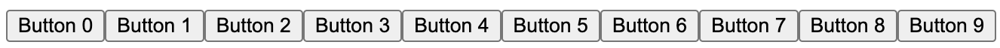
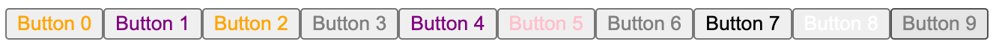

# Introduction

With Astro Forms you can easily create forms with data binding and validation. It also provides a simple way to handle form submissions and preserve state between postbacks.

## Data Binding

Astro Forms supports two-way data binding. This means that you can bind a form field to a property on `Bind` instance and the value of the property will be updated when the field changes and vice versa.

### Example

```astro
---
import { Bind, BindForm, BButton, BInput } from "@astro-utils/forms/forms.js";
import Layout from "../layouts/Layout.astro";

type Form = {
    name: string;
    age: number;
}

const form = Bind<Form>();

let showSubmitText: string;
function formSubmit(){
    showSubmitText = `You name is ${form.name}, you are ${form.age} years old. `;
    form.age++;
}
---
<Layout>
    <BindForm bind={form}>
        {showSubmitText}

        <h4>What you name*</h4>
        <BInput type="text" name="name" maxlength={20} required/>

        <h4>Enter age*</h4>
        <BInput type="int" name="age" min={10} required/>

        <BButton onClick={formSubmit} whenFormOK>Submit</BButton>
    </BindForm>
</Layout>
```

In this example, the `Bind` instance is bound to the form fields. 
- When the user changes the value of the `name` or `age` fields and submit, the `Bind` instance will be updated.
- The `formSubmit` function will be called when the user clicks the `Submit` button and the form is valid.
- After `formSubmit` the `age` property will be incremented and the `showSubmitText` will be updated.

## View State

Astro Forms also supports view state. This means that the values of the form fields will be preserved between postbacks.

### Example

```astro
---
type Form = {
    counter: number;
}

const form = Bind<Form>({counter: 0});

function incCounter(){
    form.counter++;
}
---
<Layout>
    <BindForm bind={form}>
        Counter: {form.counter}

        <BButton onClick={formSubmit}>Increase counter</BButton>
    </BindForm>
</Layout>
```

What happens here is that the `counter` property of the `Bind` instance will be incremented every time the user clicks the `Increase counter` button.

The `Bind` state will persist between postbacks, by storing the data on the client side compressed and __encrypted__.

### Valid values

The state of the `Bind` instance must be serlizable, but you can use more then just JSON.

You can use any valid [SuperJSON](https://github.com/blitz-js/superjson) value in the `Bind` instance.
Meaning also `Date`, `Map`, `URL`, `Set`, `RegExp`, `BigInt`, `undefined` are supported.


### Button State

You can use state per `BButton` component. You can also change the `BButton` props easily each time the button is clicked.

Special props:
- **state**: any - store state per button
- **extra**: any - store extra data per button (cannot be changed in the `onClick` function)
- **innerText**: string - the text of the button (overides the children)
- **innerHTML**: string - the HTML of the button (overides the children)
- **remove**: boolean - remove the button from the HTML

```astro
---
import { BButton, Bind, BindForm } from '@astro-utils/forms/forms.js';
import Layout from '../layouts/Layout.astro';

const colors = ['red', 'green', 'blue', 'yellow', 'purple', 'orange', 'pink', 'black', 'white', 'gray'];

function changeColor() {
    this.state.color++;

    if (this.state.color >= colors.length) {
        this.state.color = this.extra;
    }
    this.style = `color: ${colors[this.state.color]}`;
}
---

<Layout>
    <BindForm>
        {
            colors.map((_, i) => (
                <BButton onClick={changeColor} extra={i} state={{ color: i }}>
                    Button {i}
                </BButton>
            ))
        }
    </BindForm>
</Layout>
```

In this example, the `changeColor` will change the button color each time it is clicked for a different color in the `colors` array.

If the button is clicked more times then the length of the `colors` array, it will start from the beginning.

#### Initial state




#### After some clicks


